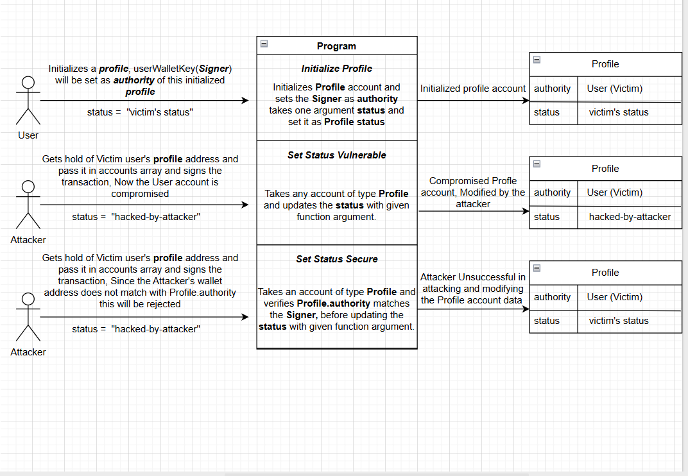
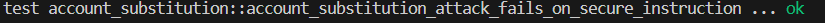
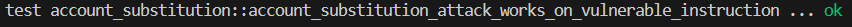

# Solana Security Lab: Account Substitution Attack
This lab demonstrates a common Solana vulnerability where a program fails to validate the relationship between a signer and a state account.  
An attacker can substitute another user's state account and modify it.

The vulnerable instruction accepts an arbitrary Profile account and an arbitrary signer, but fails to verify that the signer is the profile authority. An attacker can substitute a victim’s profile and redirect the recovery_wallet to attacker-controlled infrastructure, enabling unauthorized recovery control hijack.

## Vulnerability Type

### Account Substitution / Broken Account Relationship Validation

In Solana programs, all accounts are supplied by the transaction caller.  
If the program does not validate the relationship between accounts and their authority, an attacker can substitute another account and manipulate its data.

## Real World Relevance
Similar validation mistakes have led to real-world exploits in Solana programs where attackers manipulated state belonging to other users.

Account relationship validation is one of the most common attack surfaces in Solana programs.

## Vulnerable Code

```
    #[derive(Accounts)]
    pub struct SetRecoveryWalletVulnerable<'info> {
        pub authority: Signer<'info>,

        #[account(mut)]
        pub profile: Account<'info, Profile>,
    }
 ```

 The program verifies that a signer exists, but does not explicitly verify that the profile account belongs to that signer.

 ## Attack steps:

 1. Victim creates a Profile account
 2. Attacker constructs a transaction
 3. Attacker supplies:
    - their own signer account
    - the victim's Profile account
 4. The program accepts both accounts
 5. The attacker modifies the victim's profile

 


 ## Proof of Exploit

The Rust integration test demonstrates that an attacker can update the victim's profile using the vulnerable instruction.

Assertion:
``` assert_eq!(after_attack.authority, victim.pubkey());
    assert_eq!(after_attack.recovery_wallet, attacker.pubkey());
    assert_eq!(after_attack.status, "victim's status");
```

Test Restult:


The attacker successfully modified data belonging to another user.


 ## Secure Version

The `has_one` constraint ensures that the authority stored in the Profile account matches the provided signer.

Assertion:
``` #[account(
        mut,
        has_one = authority
    )]
    pub profile: Account<'info, Profile>,
```

Test Restult:


This enforces the correct relationship.


## Security Lesson

In Solana programs, every account passed into an instruction is attacker-controlled.

Programs must validate:

- account ownership
- authority relationships
- PDA derivations
- token mint associations

## To run this LAB:

Run the local validator first,
```
    solana-test-validator

 ```
then in another tab:
```

    anchor test --skip-local-validator
```
